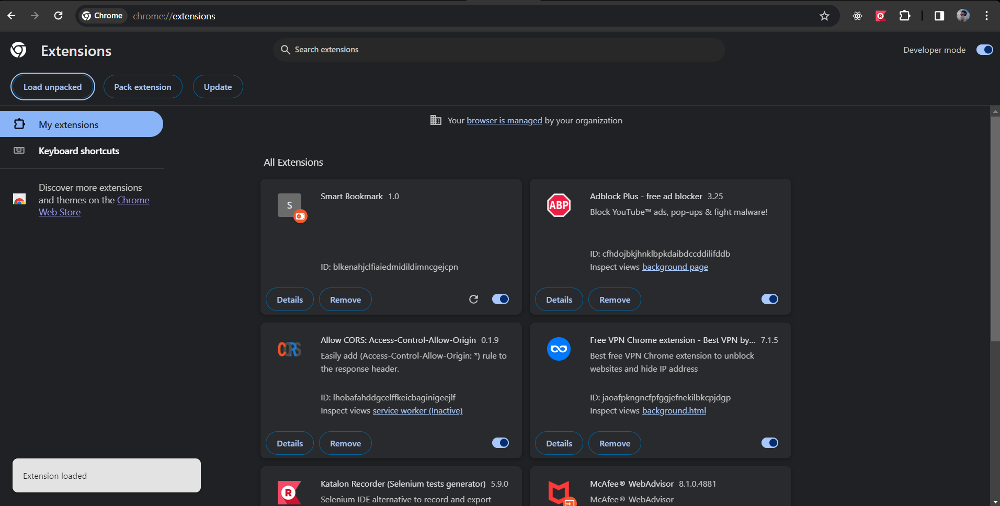

# extension- Smart Bookmark

-> Download zip file

-> Extract the zip file

-> Go to this link chrome://extensions/

-> Enable developer option

-> Click Load unpacked

-> Select the extract folder

-> Extension shows like

-> click on extensions and pin Smart Bookmark

-> click smart bookmark extension

-> Type in text area

-> Click Save Input button

-> click Save tab

-> When you click "DELETE" button it will delete the last data

-> Double click on "CLEAR ALL"butto it will Delete All data